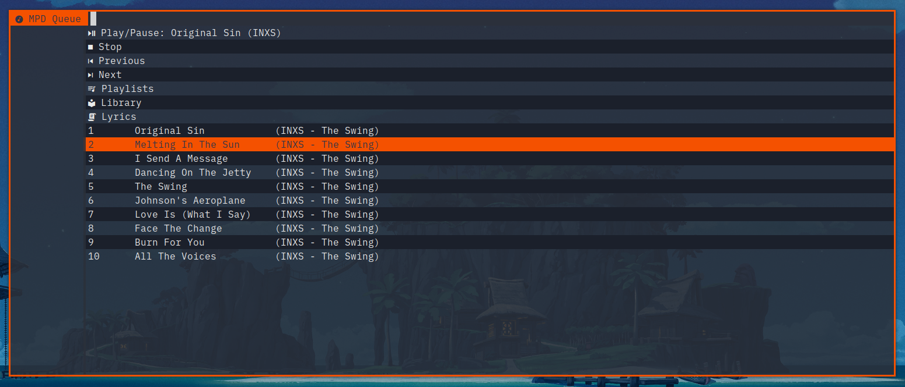

# bemenu-mpdcli

A [bemenu](https://github.com/Cloudef/bemenu) client for [MPD](https://github.com/MusicPlayerDaemon/MPD) using [mpc](https://github.com/MusicPlayerDaemon/mpc). Control you local or remote Music Player Daemon from a simple and fast menu.



The preview uses my wrapper for bemenu: [bemenu-orange-wrapper](https://github.com/tkapias/bemenu-orange-wrapper).

## Dependencies

- [MPD](https://github.com/MusicPlayerDaemon/MPD)
- [mpc](https://github.com/MusicPlayerDaemon/mpc)
- [bemenu >= 0.6](https://github.com/Cloudef/bemenu)
- [xclip](https://github.com/astrand/xclip)
- [Nerd Fonts (Symbols Only)](https://github.com/ryanoasis/nerd-fonts/releases/latest)
- Bash >= 5
- Awk

### Optional

- [bemenu-orange-wrapper](https://github.com/tkapias/bemenu-orange-wrapper)

## Installation

```bash
git clone --depth 0 https://github.com/tkapias/bemenu-mpdcli.git bemenu-mpdcli
cd bemenu-mpdcli
chmod +x bemenu-mpdcli.sh
```

- Optional: Symlink to a directory in your user's path:

```bash
ln -s $PWD/bemenu-mpdcli.sh $HOME/.local/bin/bemenu-mpdcli
```

## Features

- Display current title, albumartist (or url/filename).
- Player commands: Play/Pause, Stop, Prev, Next.
- Queue:
  - List position, title, albumartist, album (or url/filename).
  - Play selected.
- Playlists:
  - List mpd playlists by filename.
  - Replace queue with a playlist and play it.
- Library:
  - List albumartist.
  - List albums for a selected albumartist.
  - Replace queue with an album and play it.

## Usage

bemenu-mpdcli shoould work out of the box for a local mpd server.

You can also provide arguments to mpc for custom locations.

```bash
bemenu-mpdcli [--host ip/socket] [--port num] [--partition name]
```

### Integrations

- Binding example for bemenu-mpdcli in i3wm:

```i3wm
bindsym $mod+m exec --no-startup-id "bemenu-mpdcli"
```

